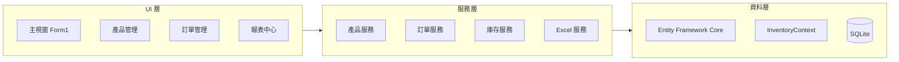
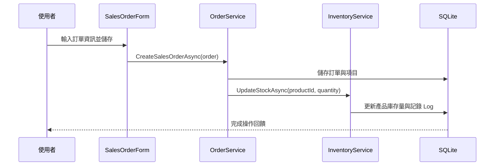

# InventorySystem 系統架構說明書

## 系統元件關係圖


## 部署拓撲圖
```mermaid
deployment
    node ClientPC [用戶端電腦] {
        artifact App [InventorySystem.exe]
        database SQLite [inventory.db]
    }
    App -- 存取 --> SQLite
```

## 資料流向圖 (以建立銷售訂單為例)


## 核心模組職責
- **Models**: 定義系統實體（Product, Customer, Order 等）與資料庫結構。
- **Services**: 封裝業務邏輯，如庫存計算、訂單總額加總、Excel 報表生成。
- **UI (Forms)**: 負責使用者互動，透過依賴注入 (DI) 取得 Service 進行資料操作。
- **Migrations**: 管理資料庫 Schema 的演進版本。

## 技術選型決策邏輯 (Rationale)
- **WinForms**: 考量開發速度與企業內部工具的穩定性，WinForms 提供成熟的控制項支援。
- **SQLite**: 輕量級、無需安裝伺服器，適合單機版庫存管理系統。
- **EF Core**: 提供強型別的資料存取，簡化 SQL 撰寫並提升維護性。
- **ClosedXML**: 處理 Excel 匯出的首選工具，API 友善且效能優異。

## 系統設計原則
- **擴展性**: 採用 Service Pattern 與 DI，方便未來替換資料來源或增加新功能。
- **安全性**: 透過 EF Core 參數化查詢防止 SQL Injection；資料庫檔案可進行加密保護。
- **效能優化**: 針對頻繁查詢的欄位建立索引；報表生成採用非同步處理避免 UI 凍結。

## 未來架構演進藍圖
1. **雲端同步**: 引入 Web API 層，將 SQLite 遷移至 SQL Server 或 PostgreSQL 以支援多使用者協作。
2. **模組化**: 將 Service 層抽離成獨立的 Class Library，支援多種 UI 端（如 Web 或 Mobile）。
3. **自動化測試**: 導入單元測試與整合測試框架，確保業務邏輯的正確性。
