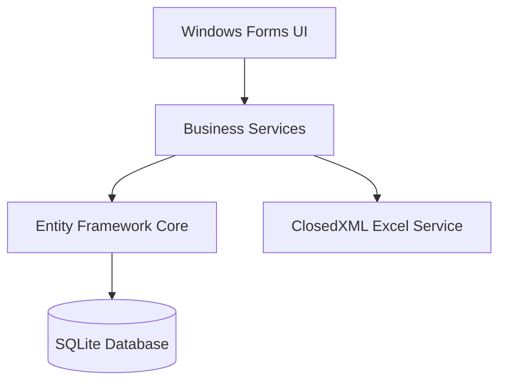

# InventorySystem 專案總覽

## 核心目標
本專案旨在提供一個輕量級且高效的庫存管理系統，協助企業管理產品、客戶、供應商以及進銷存訂單。系統透過直觀的 Windows Forms 介面，實現資料的自動化處理與報表產出。

## 技術棧清單
- **開發框架**: .NET 8.0 (Windows Forms)
- **程式語言**: C# 12
- **資料庫**: SQLite
- **ORM**: Entity Framework Core 8.0
- **報表工具**: ClosedXML (Excel 匯出)
- **依賴注入**: Microsoft.Extensions.DependencyInjection
- **組態管理**: Microsoft.Extensions.Configuration

## 環境預置需求
- Windows 10 或更高版本
- .NET 8.0 SDK
- Visual Studio 2022 (建議) 或 VS Code (搭配 C# Dev Kit)

## 系統架構圖


## 安裝與啟動步驟
1. **複製專案**:
   ```bash
   git clone <repository-url>
   cd InventorySystem
   ```
2. **還原套件**:
   ```bash
   dotnet restore
   ```
3. **資料庫遷移**:
   ```bash
   dotnet ef database update
   ```
4. **啟動應用程式**:
   ```bash
   dotnet run
   ```

## 測試指令集
目前專案主要透過手動測試驗證 UI 功能。若需執行維護指令：
- **更新訂單總額**:
  ```bash
  dotnet run -- --update-totals
  ```

## 部署流程說明
1. **發佈應用程式**:
   ```bash
   dotnet publish -c Release -r win-x64 --self-contained true
   ```
2. **打包產出物**: 將 `bin/Release/net8.0-windows/win-x64/publish/` 目錄下的所有檔案打包。
3. **部署**: 將打包檔案解壓縮至目標機器，並確保已安裝必要的執行環境（若非 self-contained）。

### 發佈後資料庫初始化
若直接在發佈目錄執行 `InventorySystem.exe`，需先確認同一路徑下的 `inventory.db` 已建立資料表。空白資料庫會造成 EF Core 嘗試存取缺失的表時拋出例外。

1. **建立資料表**: 在開發環境或可執行 `dotnet ef` 的機器，進入專案根目錄後
   ```bash
   dotnet ef database update
   ```
   會根據 `Migrations/` 中的遷移紀錄建立或更新 `inventory.db`。
2. **複製資料庫**: 將生成的 `inventory.db` 搬到發佈目錄 (與 `InventorySystem.exe` 同層)，此檔案包含 Schema 與預設資料。
3. **初次啟動**: 發佈環境首次執行可先確認 `.db` 檔案被鎖定前無權限問題，其後便可正常啟動。

## API 文件索引連結
本專案為桌面應用程式，內部 Service API 請參考 `Services/` 目錄下的原始碼註解。

## 貢獻指南
1. Fork 本專案。
2. 建立功能分支 (`git checkout -b feature/AmazingFeature`)。
3. 提交更改 (`git commit -m 'Add some AmazingFeature'`)。
4. 推送到分支 (`git push origin feature/AmazingFeature`)。
5. 開啟 Pull Request。

## 授權資訊
本專案採用 MIT 授權條款。詳見 [LICENSE](LICENSE) 檔案。
